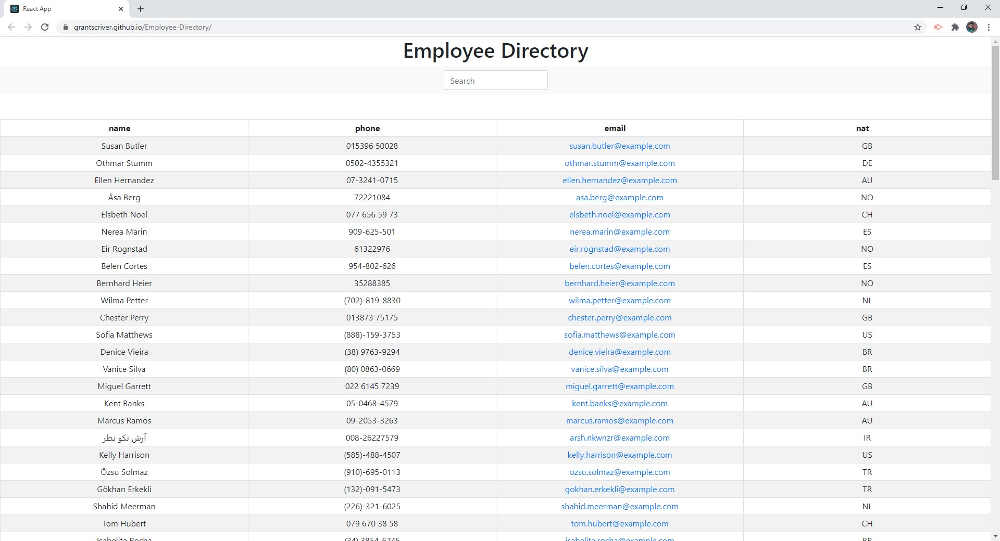

# Employee-Directory

[Live Site](https://grantscriver.github.io/Employee-Directory/)

## Table of Contents

- [Description](#description)
- [License](#license)
- [Contributions](#contributions)
- [Test](#test)
- [Technologies](#technologies)
- [Questions](#questions)

## Description:

This React app uses an API call to populate employee data. Each employee can be filtered by Name, Phone Number, Email, or Nationality. Users are also able to search for a specific employee using the search bar.

## License:

## Contributions:

Right now I am the only one who has contributed, if you would like to then send a pull request and I will review it.

## Test:

No testing.

## Technologies:

This is a application that uses Node.js to route the back-end while the front end uses HTML, CSS, and Javascript. It utilizes a random user API call to populate the employee data. Finally it is deployed as a React application through GitHub pages.

## Questions

For more information you can visit my [Github](https://github.com/grantscriver)
If you have any additional questions you can email me at: Grantscriver@gmail.com